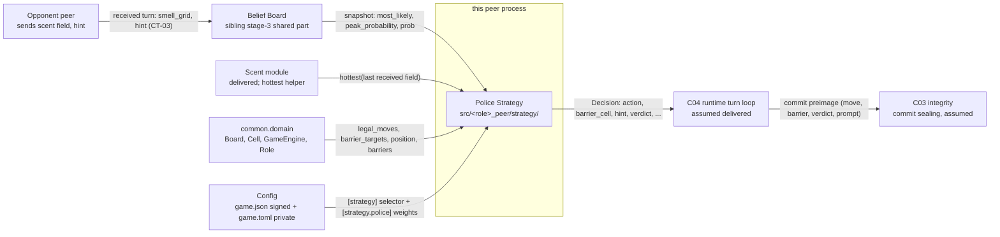
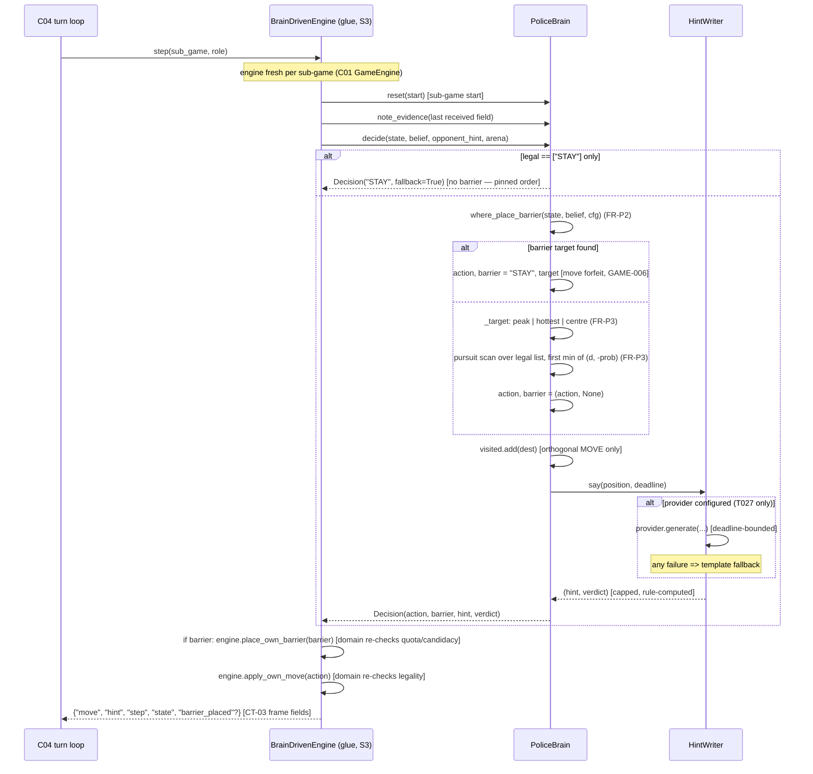
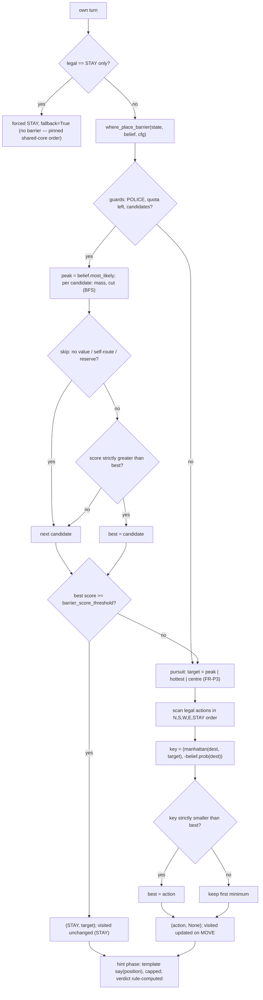
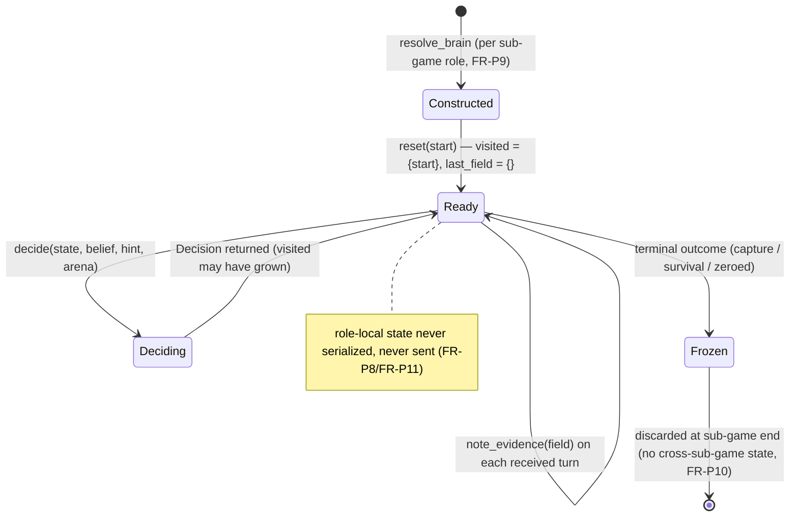

# PLAN — Police Strategy (Stage 3, role-specific part)

## 1. Approach summary

Build one module per repository — `src/police_peer/strategy/` — holding the Police's
decision policy over the CT-01 legal set (move or barrier), plus the **shared core** of
the strategy module that both role repositories carry identically (modulo package import
path and the role constant, the shared-scent/belief precedent):

| File | Kind | Responsibility |
|---|---|---|
| `strategy/decision.py` | shared core | the frozen `Decision` contract (PRD §5.3) |
| `strategy/base.py` | shared core | `BrainBase` — pinned two-phase `decide()`, role-local `visited` + `last_field` |
| `strategy/hints.py` | shared core | `HintWriter` (template default) + `TextProvider` seam; landmark names from `belief.hints` |
| `strategy/inject.py` | shared core | `resolve_brain_cls` / `resolve_brain` — config-selected brain, fail-fast |
| `strategy/barriers.py` | **role-specific** | `where_place_barrier` — the pure barrier decision function (PRD FR-P2) + `cut_value` + BFS helper |
| `strategy/police.py` | **role-specific** | `PoliceBrain` — barrier-first `_decide_move`: `where_place_barrier` then the two-key pursuit scan (M-03 derived design) |
| `strategy/__init__.py` | shared core | public re-exports only |

The policy reads only what the stage entry criteria guarantee: the C01 `GameEngine`
(legal set, barrier targets, own position, own barrier ledger), the belief snapshot
(PRD-BELIEF-BOARD FR-B6 queries), the last received scent field (via a `note_evidence`
hook, SD-P5), and private config. It writes one thing: a `Decision`. No transport, no
clock, no network in `strategy/`; no engine mutation either — `apply_own_move` /
`place_own_barrier` are called by the C04 glue (S3a), which re-checks legality/quota at
the domain boundary.

Integration continues the stage-2 top-down spine (PLAN-MCP-INFRA §12/SD-03 and
`PLAN_belief_board.md` §12): the role glue's stand-in engine
(`src/police_peer/wire/`: `legal_moves[0]` + canned hint) is replaced **behind the
existing `TurnEngine` seam** by a brain-driven engine, and the spine test
(`tests/integration/test_series_loopback.py`) must stay green after every swap. The
belief half is already wired by the belief stage (S1/S2); this stage replaces only the
*decision* half, on top of the real belief.

Binding integration strategy:

1. Build the shared core + `barriers.py` + `PoliceBrain` against plain data (no
   transport), unit-first.
2. Hardening tests for the verbal layer (isolation, verdict rule, cap, lie rate).
3. Swap the stand-in decision on the role-glue decision path (S3a/S3b/S3c); spine green.
4. Property/KPI/determinism/perf suites + coverage close the stage; the shared-core sync
   check runs once the thief counterparts' code exists.

## 2. C4 — Level 1: Context



External actors: the opponent peer (evidence source — never a source of *truth*; unlike
the Thief's board, it declares no barriers), the signed constitution, the private tuning
file. The strategy has no other external dependency: no network, no disk, no clock.

## 3. C4 — Level 2: Container (one peer process)

```mermaid
flowchart TB
    subgraph peer process
        subgraph C04 runtime reliability (assumed delivered)
            TH[TurnHandler — update path]
            TS[TurnSender — decision path]
            SM[Orchestrator FSM]
        end
        subgraph C02 perception strategy
            subgraph belief [belief/ — sibling shared part]
                BGRID[grid.py — BeliefGrid]
                BHINTS[hints.py — LANDMARK_CELLS]
            end
            subgraph strategy [strategy/ — THIS PLAN]
                DEC[decision.py]
                BASE[base.py — BrainBase]
                HINTW[hints.py — HintWriter]
                INJ[inject.py — seam]
                BARR[barriers.py — where_place_barrier]
                POLICE[police.py — PoliceBrain]
            end
            SCENTBOX[scent/ — delivered]
        end
        GLUE[role glue wire/<br/>BrainDrivenEngine — S3 swap]
        C01[common.domain — Board, Cell, GameEngine]
        TH --> BGRID
        TH -- "note_evidence(field)" --> GLUE
        TS --> GLUE
        GLUE --> INJ
        INJ --> POLICE
        POLICE --> BASE
        POLICE --> BARR
        BASE --> HINTW
        HINTW -. "imports LANDMARK_CELLS (SD-B3)" .- BHINTS
        POLICE --> BGRID
        BARR --> BGRID
        POLICE --> SCENTBOX
        C01 --> POLICE
        C01 --> BARR
        C01 --> BASE
    end
```

Dependency direction is strictly inward: `strategy/` never imports `wire/`, `transport/`,
or `ui/`. The dashed line is *content* sharing — one landmark table imported from
`belief.hints`, never copied (SD-B3 of the belief PLAN). The glue imports `strategy/`;
`strategy/` does not know the glue exists. `barriers.py` depends on the belief snapshot
and the C01 geometry only — it is importable and testable without a brain instance.

## 4. C4 — Level 3: Component

| Module | Responsibility | Owns state? |
|---|---|---|
| `strategy/decision.py` | `Decision` frozen dataclass + field invariants (PRD §5.3) | no |
| `strategy/base.py` | `BrainBase`: pinned `decide()` (move phase → hint phase), forced-STAY handling, `visited` update, `note_evidence` | yes — `visited: set[Cell]`, `last_field: dict[str, float]` (role-local, per sub-game) |
| `strategy/hints.py` | `HintWriter` (role-parameterized template banks, lie roll, verdict rule, `_cap`), `TextProvider` Protocol seam (T027) | no (RNG injected) |
| `strategy/inject.py` | `resolve_brain_cls` (fail-fast selector), `resolve_brain` (seeded construction) | no |
| `strategy/barriers.py` | `where_place_barrier` (the FR-P2 pipeline: guards → mass/cut → skip rules → reserve → threshold), `cut_value` (BFS region collapse), `_reachable` (flood-fill helper) | no (pure functions) |
| `strategy/police.py` | `PoliceBrain`: barrier-first `_decide_move` (FR-P2/FR-P4), pursuit scan with diffuse fallback (FR-P3) | no (weights as constructor args) |
| `strategy/__init__.py` | public re-exports: `BrainBase`, `Decision`, `HintWriter`, `TextProvider`, `PoliceBrain`, `where_place_barrier`, `resolve_brain`, `resolve_brain_cls` | no |

State ownership rule (AGENTS.md): the only mutable strategy state is `BrainBase.visited`
and `BrainBase.last_field`, both role-local, both reset per sub-game, neither serialized
nor sent (FR-P8/FR-P11). The engine owns position/barriers (C01) and is never mutated by
`strategy/`; the belief owns the distribution (belief stage); the config manager owns
config (C01).

## 5. C4 — Level 4: Code (module APIs)

Signatures as they will exist; bodies are the task-level detail
(`TODO_police_strategy.md`).

### 5.1 `strategy/decision.py` (shared core)

```python
@dataclass(frozen=True)
class Decision:
    """The CT-02 response: one legal action + the verbal phase + audit metadata.

    Invariants: `action` is a member of this turn's CT-01 legal set;
    `barrier_cell` is None for THIEF (role guard, M-04) and, for POLICE,
    requires action == "STAY" and membership in barrier_targets() under quota;
    `hint` is at most hint_max_words words; `verdict` is sealed for audit.
    The serializable projection (action, barrier_cell as [r,c] | None, hint,
    verdict) feeds the canonical-JSON commit preimage (SPEC section 2) via C03.
    """
    action: str
    barrier_cell: Cell | None = None
    hint: str = ""
    verdict: str = "truth"          # "truth" | "lie"
    fallback: bool = False          # True when forced STAY (no legal orthogonal move)
    reasoning: str = ""             # "" for template mode
    prompt_text: str = ""           # sealed (prompt_discussion) for audit; "" for template
    response_seconds: float = 0.0   # hint-phase timing metadata; never a decision input
```

### 5.2 `strategy/base.py` (shared core)

```python
class BrainBase:
    """Shared strategy core. Phase order is PINNED (M-03 {#hint_isolation}):
    the move is selected first by pure Python — the LLM is NEVER consulted here
    (NG-003) — and the hint is produced afterwards; a hint can never influence
    an already-selected move."""

    role: Role

    def __init__(self, rng: random.Random, arena: str, max_words: int,
                 hint_writer: HintWriter) -> None: ...

    def reset(self, start: Cell) -> None:
        """Fresh sub-game: visited = {start}; last_field = {} (role-local only)."""

    def note_evidence(self, field: dict[str, float]) -> None:
        """Remember the last received scent field (the role's diffuse-fallback
        input). Called by the C04 turn handler on each received turn, BEFORE
        decide() (SD-P5). The field is evidence, never opponent truth."""

    def decide(self, state: GameEngine, belief: BeliefGrid, opponent_hint: str,
               arena: str, deadline: float | None = None) -> Decision:
        """THE pinned two-phase decision (PRD FR-P1…FR-P7).

        1. legal = state.legal_moves(); if legal == ["STAY"]:
           return Decision("STAY", fallback=True)   # forced STAY; no barrier (pinned order)
        2. action, barrier = self._decide_move(state, belief)   # pure Python
        3. dest = destination of the chosen action; on an orthogonal MOVE:
           visited.add(dest)
        4. hint, verdict = hint_writer.say(dest, deadline=deadline)   # FROM the
           chosen destination, never the pre-move position: the engine applies
           the move only after decide() returns.
        5. return Decision(action, barrier, hint, verdict, fallback=False)
        """

    def _decide_move(self, state: GameEngine, belief: BeliefGrid) -> tuple[str, Cell | None]:
        """(action, barrier_cell). PURE PYTHON. The LLM is NEVER consulted here (NG-003)."""
```

### 5.3 `strategy/hints.py` (shared core, role-parameterized)

```python
class TextProvider(Protocol):
    """Provider-neutral seam for the optional LLM adapter (T027, P2, gated by
    PLANQ-003/004). NEVER on the movement path (STRAT-008, NG-003)."""
    def generate(self, role: Role, position: Cell, arena: str, max_words: int,
                 deadline: float | None) -> dict[str, str] | None:
        """Strict JSON {"message", "verdict", "reasoning"}, or None on any
        failure/timeout/unparseable reply (template fallback then applies)."""

class HintWriter:
    """Template-default verbal layer (STRAT-008). Landmark names imported from
    belief.hints.LANDMARK_CELLS (SD-B3 — one table, both directions)."""

    def __init__(self, role: Role, rng: random.Random, arena: str, max_words: int,
                 provider: TextProvider | None = None) -> None: ...

    def say(self, position: Cell, *, deadline: float | None = None) -> tuple[str, str]:
        """(hint, verdict). Template mode (default, zero tokens):

        - lie roll: rng.random() < 0.4 (reference behaviour, seeded);
        - truth: assert a landmark region containing (or Chebyshev-adjacent to)
          `position`; none applicable ⇒ generic non-landmark line (no claim);
        - lie: assert a landmark region NOT containing (or adjacent to) it;
        - verdict RULE-COMPUTED: "truth" iff the asserted region contains or is
          Chebyshev-adjacent to `position` — the role knows its own position,
          so the verdict is always well-defined and audit-consistent;
        - _cap truncates to max_words (for LLM providers the arena + cap also
          enter the system prompt, reference behaviour).
        Provider mode (T027): call with deadline; any failure ⇒ template.
        """
```

### 5.4 `strategy/inject.py` (shared core)

```python
_SELECTORS = {Role.THIEF: "thief_class", Role.POLICE: "police_class"}

def resolve_brain_cls(config: Mapping[str, object] | None, role: Role) -> type[BrainBase]:
    """The config selector ([strategy] thief_class / police_class, dotted
    "package.module:ClassName") if set, else the shipped default for `role`
    (police_repo: PoliceBrain; the opposite-role default is PLAN SD-P7).
    Fail-fast: ValueError on malformed selector / missing attribute; TypeError
    if the target is not a BrainBase subclass."""

def resolve_brain(config: Mapping[str, object] | None, role: Role,
                  llm: object | None = None,
                  rng: random.Random | None = None) -> BrainBase:
    """Instantiate the resolved class with: rng (default: seeded from the
    resolved config's seed), arena + hint_max_words from the resolved config,
    and the template HintWriter (provider only via T027). The C04 runtime never
    hard-codes a brain (book section 6.2, reference runtime.py L73 pattern)."""
```

**Shared-core sync notes (for the PS-07/TS-07 ORC check).** The shared-core sections
above mirror the thief PLAN's §5.1–5.4 modulo role words, with three role-justified
divergences recorded here so the sync check normalizes them deliberately instead of
flagging them as drift: (1) the `note_evidence` docstring's fallback reference — thief
spec FR-T2 vs. this doc's FR-P3; the shared code docstring is role-neutral ("the role's
diffuse-fallback input"); (2) the forced-STAY comment line — the same pinned behavior
is pre-capture for the Thief (rule 47, domain-decided) and a neutral stuck state for the
Police; the shared code comment is the role-neutral "forced STAY; no barrier (pinned
order)"; (3) the `resolve_brain_cls` default-brain line — `thief_repo: ThiefBrain` /
`police_repo: PoliceBrain` plus each repo's SD-T7/SD-P7 pointer, which the role-constant
clause of the sync rule covers.

### 5.5 `strategy/barriers.py` (role-specific — `police_repo` only)

```python
def where_place_barrier(state: GameEngine, belief: BeliefGrid, cfg: Mapping[str, object]) -> Cell | None:
    """Decide WHETHER to place a barrier this turn and WHERE (from
    state.barrier_targets()). Returns the target cell, or None (= move
    instead). Pure, deterministic. Pipeline (PRD FR-P2, fixed order):

    1. Guards, else None: state.role is Role.POLICE;
       state.barriers_placed < state.barriers_max;
       candidates = state.barrier_targets() non-empty.
    2. peak = belief.most_likely().
    3. Per candidate c (barrier_targets() order — own cell first, then
       in-bounds unblocked orthogonal neighbours in N, S, W, E order):
           mass = belief.prob(c)
           cut  = cut_value(state, c, peak)
           skip if mass < cfg["barrier_mass_floor"] and cut == 0   # no value
           skip if the Police->peak BFS distance worsens by more
                than cfg["route_slack"] when c is added            # self-route
           score = cfg["w_mass"] * mass + cfg["w_cut"] * (cut / before)
           skip (reserve) if remaining <= cfg["barrier_reserve"]
                and score < cfg["strong_threshold"]
           keep the best (strictly greater; first candidate wins ties)
    4. Return the best iff its score >= cfg["barrier_score_threshold"],
       else None.
    """

def cut_value(state: GameEngine, c: Cell, peak: Cell) -> int:
    """Region collapse from adding barrier `c`: before - after, where
    before/after are _reachable sizes from `peak` (orthogonal, barriers
    impassable). If c == peak: returns `before` — full region collapse plus
    the rule-46 capture gamble (GAME-010): a barrier on the Thief's cell is a
    capture the Thief must honestly acknowledge. `before` is >= 1 because the
    belief excludes barrier cells (belief FR-B4); a defensive assert pins it."""

def _reachable(board: Board, from_cell: Cell, barriers: frozenset[Cell]) -> int:
    """BFS flood-fill size from `from_cell`: orthogonal neighbours, in-bounds,
    barriers impassable. The only graph helper in the module; pure O(cells)."""
```

The same `_reachable`-based BFS distance (Police→peak, with/without `c`) serves the
self-route check; unreachable is a sentinel larger than any finite slack, so the
guard is vacuous when the Police is already cut off from the peak (edge pinned by
TC-P09).

### 5.6 `strategy/police.py` (role-specific — `police_repo` only)

```python
class PoliceBrain(BrainBase):
    """The M-03 pursuit policy: barrier first via where_place_barrier (FR-P2),
    then the two-key pursuit scan over the CT-01 legal list (FR-P3; derived
    design — PLANQ-008 records the approved priorities)."""

    def __init__(self, *, min_confidence: float = 0.10,
                 barrier_mass_floor: float = 0.05, w_mass: float = 1.0,
                 w_cut: float = 0.5, route_slack: int = 1,
                 barrier_reserve: int = 3, strong_threshold: float = 0.8,
                 barrier_score_threshold: float = 0.3, **base) -> None: ...

    def _target(self, state: GameEngine, belief: BeliefGrid) -> Cell:
        """FR-P3, fixed order: belief.most_likely() when
        belief.peak_probability() >= min_confidence; else
        scent.hottest(self.last_field); else the board centre."""

    def _decide_move(self, state: GameEngine, belief: BeliefGrid) -> tuple[str, Cell | None]:
        """Barrier first (FR-P2/FR-P4), then pursuit (FR-P3):

        target_cell = where_place_barrier(state, belief, self._cfg)
        if target_cell is not None:
            return "STAY", target_cell        # move forfeit (GAME-006);
                                              # the glue declares barrier_placed
        # pursuit scan:
        threat = self._target(state, belief)
        for action in state.legal_moves():    # CT-01 order: N, S, W, E, STAY
            dest = state.board.step(state.position, action)   # STAY -> position
            key  = (manhattan(dest, threat), -belief.prob(dest))
            # FIRST strict minimum in CT-01 order — deterministic tie-break
        Returns (action, None)
        """
```

All inputs to the policy are verified repo APIs: `Board.legal_moves(cell, barriers)`
(orthogonal in fixed order + `STAY` last), `Board.step`, `Board.barrier_targets(cop,
barriers)` (`[cop]` + unblocked orthogonal neighbours), `manhattan(a, b)`
(`common/domain/board.py`); `GameEngine.legal_moves()`, `barrier_targets()` (Police +
quota-gated), `.position`, `.barriers`, `.barriers_placed`, `.barriers_max`, `.board`,
`.step` (`common/domain/rules.py`); `hottest(field)` (`police_peer/scent/model.py`,
lexicographic tie-break); belief queries per FR-B6. The engine-mutating methods
(`apply_own_move`, `place_own_barrier`) are **not** called by `strategy/` — the C04
glue applies the `Decision` (S3a).

## 6. UML — Sequence: one own turn at the decision path



## 7. UML — Flow: barrier pipeline, pursuit ranking and edge handling



Edge cases pinned by tests: empty field (pursuit branch d), all-barriers-remaining
(quota guard), an already-cut-off Police (self-route guard vacuous, TC-P09), the
peak adjacent to a barrier ring (cut = before on the peak candidate, TC-P08), the
own cell as candidate (waling behind — the score decides), `min_confidence` exactly
at the boundary (`>=`, deterministic side pinned by TC-P03), a target where `STAY`
is the first minimum (the Police holds the cell — legal, TC-P03(a)).

## 8. UML — State: brain lifecycle per sub-game



## 9. Deployment

In-process; nothing to deploy. The module adds no ports, no files, no environment
variables. Both role repositories ship their copy independently (environment
separation, ARCH-001/002); the shared-core files stay mutually consistent through the
ORC sync check (TODO PS-07, the cross-repo rule).

## 10. Data Contracts

The strategy **sends nothing on the wire directly** — it sits behind the already-delivered
CT-03 envelope and the C03 commit path:

| Direction | Contract | Fields touched |
|---|---|---|
| in | CT-01 local state (`GameEngine`) | `legal_moves()`, `barrier_targets()`, `position`, `barriers`, `barriers_placed`, `barriers_max`, `board` (geometry, size), `step` |
| in | CT-02 request — belief snapshot | `most_likely()`, `peak_probability()`, `prob(cell)` (PRD-BELIEF-BOARD FR-B6) |
| in | last received field | CT-03 `smell_grid` (`{"r,c": float}`) via the C04 `note_evidence` hook (SD-P5) |
| out | CT-02 response (`Decision`) | `action` (CT-01 legal set), `barrier_cell` (legal `barrier_targets()` cell under quota, or `None`), `hint` (≤ 15 words), `verdict`, `fallback`, `reasoning`, `prompt_text`, `response_seconds` |
| out | CT-03 `TurnMessage` projection (via C03/C04) | `hint` → `hint`; `action` + `barrier_cell` + `verdict` + `prompt_text` → commit preimage (canonical JSON, SPEC §2); `barrier_cell` → `barrier_placed` `[r,c]` in the same turn (open + exact, GAME-012); `capture_claim` on a MOVE — runtime/C03-owned (truthful claim of the Police's own position, GAME-009/SEC-007), not a strategy field (FR-P5) |

Additive-only rule (CT-02): the `Decision` fields above are the whole surface; this PLAN
does not invent new belief queries, new engine fields, or new wire keys. The serializable
projection is plain `str`/`int`/`None` so C03 can canonicalize it without strategy-aware
code (PRD §10).

## 11. Configuration

Per PRD §9: private `[strategy]` (selector) + `[strategy.police]` (pursuit floor
`min_confidence`; barrier weights/thresholds `barrier_mass_floor`, `w_mass`, `w_cut`,
`route_slack`, `barrier_reserve`, `strong_threshold`, `barrier_score_threshold`),
consumed through the C01 config manager's resolved mapping (no file I/O in `strategy/` —
`resolve_brain` takes the mapping, `where_place_barrier` takes the `cfg` mapping). Shared
signed values consumed: `board_and_agents.grid_size`, `movement_and_barriers.move_set`,
`movement_and_barriers.max_barriers` (the GAME-008 quota), `world.map_area`,
`world.hint_max_words`. Precedence: shared JSON overlays private TOML on conflict (CFG
rules); the `[strategy]` keys have no shared counterparts.

## 12. Integration Spine — Stub Replacement Map

Continues the stage-2 discipline (PLAN-MCP-INFRA §12/SD-03) and the belief stage's S1/S2
(real belief already wired into the turn handler):

| Step | Replace | With | Spine invariant |
|---|---|---|---|
| S3a | stand-in move selection in the role glue (`legal_moves[0]`) on POLICE sub-games | `BrainDrivenEngine` behind the `TurnEngine` seam: `resolve_brain(config, role)` per sub-game + `brain.decide(...)` + when `barrier_cell` is set: `engine.place_own_barrier(barrier_cell)` then `engine.apply_own_move(action)` + the frame's `barrier_placed` field (GAME-012 same-turn declaration) | `tests/integration/test_series_loopback.py` green |
| S3b | stand-in canned hint (`"I am here"`) | `HintWriter` template output on the outgoing frame (same `Decision.hint`) | same spine green |
| S3c | (wiring, not a replacement) | `brain.note_evidence(field)` on each received turn, before the decision (SD-P5) | same spine green |

The opposite-role (THIEF) sub-game **keeps the stand-in selection** on this repository
(SD-P7) until the thief stage's brain is ported — the series still settles end-to-end
(S3a keeps the glue's existing opposite-role path). No big-bang: each swap is its own task
with its own green run (TODO PS-04).

Write-set note (workflow §4 — no silent scope expansion): the glue file
`src/police_peer/wire/__init__.py` and the KPI harness (`tests/integration/`) are outside
T007's declared write set; the ORC records the extensions (or assigns a small follow-on
task) in `docs/tasks/` **before** PS-04/PS-06 are claimed, the same pattern as the belief
stage's FR-B9 seam recording.

## 13. Stage Decisions (promote to ADRs only if the orchestrator wants durable records)

### SD-P1 — Scored pursuit + `where_place_barrier` over the reference chase + roll

**Decision:** ship the two-key pursuit scan (distance primary, `-belief.prob(dest)`
secondary, CT-01 first-minimum tie-break) plus the budgeted barrier pipeline of
`where_place_barrier` as the final Police policy; keep the reference chase +
`rng.random() < 0.15` barrier roll as the A/B baseline in the KPI harness.
**Rationale:** the reference baseline's failure mode is structural — the roll is blind to
belief *and* topology: it burns the 14-barrier quota early, sometimes walls the Police's
own corridor, and never saves the last barriers for the endgame, where a cut converts
pursuit into forced capture (report §5.2/§10 item 5 flags it explicitly: "a basic
default … students improve placement"). The pursuit's secondary key disambiguates
equidistant destinations by likelihood — the reference's pure distance `min` treats them
as ties; it is police-specific, and the Thief doc's SD-T6 records the symmetric rejection
of importing it into the evasion policy. The weights/thresholds are **project
convention** (M-03 derived-design split), pinned in PRD §9 as the PLANQ-008 approval
baseline. **Trade-off:** tuned weights may be suboptimal against an unknown Thief; the KPI
harness (20 seeded games) is the measurable check, and re-tuning is a config edit, not a
code change. **Alternatives:** reference chase + roll (rejected as final, kept as
baseline), full lookahead minimax/expectimax (P2), RL (P2), LLM (forbidden by default —
an LLM-hallucinated barrier is the costliest mistake class in this game, GAME-007).

### SD-P2 — Barrier decision as one named pure function in its own module

**Decision:** the whether-and-where barrier decision is a single **pure function**,
`where_place_barrier(state, belief, cfg) -> Cell | None`, in `strategy/barriers.py`
with a fixed pipeline (guards → mass/cut → skip rules → reserve → threshold); the
`PoliceBrain` evaluates it **before** movement selection and returns `("STAY", target)`
on a hit. **Rationale:** the user-mandated shape (a named function that decides *if* and
*where*); purity makes every pipeline step testable in isolation (TC-P07…P11) and
determinism trivial; a separate module keeps `police.py` under the 150-line cap and keeps
the barrier policy swappable without touching the pursuit; the `None` return type encodes
"move instead" so the two options share one decision point. **Trade-off:** the brain
evaluates the pipeline on every turn even when it ends up moving (≤ 5 candidates × a few
hundred cell operations — negligible at this board size, measured by TC-P21).
**Alternatives:** the reference 0.15 roll (rejected as final — belief- and
topology-blind), a barrier *score term* folded into the pursuit scan (rejected: it would
conflate the move-forfeiting mechanic — GAME-006 forces `STAY` — with a ranking key and
break the `("STAY", target)` shape), lookahead barrier planning (P2).

### SD-P3 — Barrier value: BFS region collapse + self-route guard + quota reserve

**Decision:** a candidate's value is `w_mass * mass + w_cut * (cut / before)`, where
`cut` is the immediate reachable-region collapse from the peak (BFS flood-fill before vs.
after; a candidate on the peak collapses the whole region and carries the rule-46
gamble, GAME-010); the candidate is skipped if it has no value (low mass, zero cut), if
it severs the Police's own route to the peak by more than `route_slack`, or if quota is
running out and the score is not strong (`barrier_reserve`/`strong_threshold`); the best
candidate places only above `barrier_score_threshold`. **Rationale:** a barrier is
irreversible (GAME-007), so its *immediate* topological effect is the only value the
policy can compute without a model of the Thief; the mass term prices the rule-46
capture directly from the belief; the self-route guard is a one-line BFS comparison that
prevents the classic self-trap (walling the one corridor to the peak); the reserve is a
fixed proxy for the endgame, where a single cut usually converts the capture.
**Trade-off:** one-shot greedy — the multi-turn squeeze a cut sets up is not priced, and
the reserve is a fixed heuristic rather than an optimization; the `≤ 8 barriers` KPI
(PRD §2.3) and the 20-game harness are the measurable economy checks.
**Alternatives:** always wall the most-likely neighbour (rejected: ignores region
collapse and the self-route), never wall (rejected: the barrier mechanic is core —
GAME-006/007/008 — and the report's headroom item 5 names it), full barrier lookahead
(P2).

### SD-P4 — Role-local `visited` in `BrainBase`, not in the engine (shared core)

**Decision:** `visited: set[Cell]` lives in `BrainBase` (init `{start}`; add on orthogonal
MOVE only; never serialized, never sent; reset per sub-game). **Rationale:** this repo's
`GameEngine` has no visited set, and the engine is C01-owned shared code — adding a
policy-specific field there would push strategy concerns into the domain (ARCH-007
boundary). The Thief policy consumes it (that doc's FR-T8); the Police policy does not
consume it this stage, but the field stays in the shared core so both role brains share
one base and a future Police term can read it without a shared-core change. It is
role-local evidence, so STRAT-001/OBS-002 are respected. **Trade-off:** a second
per-sub-game state object in the strategy; negligible, and reset is one line.
**Alternatives:** engine field (rejected: C01 write-set + boundary), recompute from the
sealed log (rejected: the log is C03 territory and needs the opponent's audit context).

### SD-P5 — Last received field remembered via a `note_evidence` hook (shared core)

**Decision:** `BrainBase.note_evidence(field)` is called by the C04 turn handler on each
received turn, before `decide()`; the diffuse fallback (FR-P3) reads `self.last_field`.
**Rationale:** the shared-core `decide()` signature is binding for both role docs and
cannot grow a field parameter without a CT-02 contract change for a role-local
convenience; the field is legitimate evidence (the opponent's transmitted scent,
STRAT-001), not opponent truth. **Trade-off:** one hook call in the glue per received
turn (S3c); the hook is a no-op store. **Alternatives:** extend the CT-02 request
(rejected: additive-only contract change for a local convenience), read it from the engine
(rejected: the engine is C01-owned and scent-free by design).

### SD-P6 — Template mode is the only provider this stage; the seam is defined, the adapter deferred (shared core)

**Decision:** `TextProvider` (Protocol) is defined in the shared core `hints.py`; this
stage ships template mode only; the provider-neutral adapter is T027 (P2, `optional:
true`, gated by PLANQ-003/PLANQ-004 `blocks: start` on that task only). **Rationale:**
STRAT-008 recommends zero-token template as the default; PLANQ-003 (whether to enable a
provider at all) is `TBD_TEAM_DECISION` — building the adapter now would work against an
unmade team decision. The seam costs one small Protocol and keeps T027 a drop-in.
**Trade-off:** none at this stage (the fallback path is the template anyway).
**Alternatives:** build the adapter now (rejected: gated decision), no seam (rejected:
T027 would then patch the shared core).

### SD-P7 — Opposite-role sub-games keep the stand-in until the thief stage ports

**Decision:** the brain is resolved per sub-game role (FR-P9). In `police_repo`, POLICE
sub-games run `PoliceBrain`; THIEF sub-games keep the stage-2 stand-in selection on the
glue's existing path, labeled as such. **Rationale:** the Thief policy is role-owned by
`thief_repo` (M-04; its designed behaviour — scored evasion — must not be designed or
duplicated here, M-03's separation argument in reverse). The spine stays green either
way, and the KPI harness is role-pinned (TC-P22), so no measurement depends on the
opposite-role default. **Trade-off:** a Police peer's even sub-games play a dumb policy
until the port; acceptable mid-stage, and the port is a recorded follow-on.
**Alternatives:** implement the reference ThiefBrain here (rejected: role-ownership
violation), a designed thief policy here (rejected: same, plus it would pre-empt the
thief PRD), refuse to run series (rejected: the spine requires a full six-sub-game
series).

## 14. Requirement → Module → Test Traceability

| Req | Module (file.function) | Tests |
|---|---|---|
| ARCH-007 (strategy is a separate module) | the `strategy/` package boundary; `inject.py` (seam) | TC-P15, TC-P17, TC-P23 |
| STRAT-001 (own position + belief only) | `base.py:decide` inputs; `police.py`, `barriers.py` (no opponent-truth parameter) | TC-P02, TC-P19 |
| STRAT-006 (belief materially influences selection) | `police.py:_target`, `_decide_move`; `barriers.py:where_place_barrier` (peak + prob) | TC-P03, TC-P04, TC-P05, TC-P08 |
| STRAT-007 (heuristic route, none required) | `police.py` (route 2, book §6.3.1); KPI vs baseline | TC-P22 |
| STRAT-008 (template default; LLM text-only) | `hints.py:HintWriter` (+ `TextProvider` seam) | TC-P14, TC-P15 |
| STRAT-009 (truth or deception; arena + cap) | `hints.py:say` (banks, lie roll, `_cap`) | TC-P14, TC-P16 |
| GAME-006 (barrier placement forfeits the move) | `police.py:_decide_move` (the `("STAY", target)` shape) | TC-P02, TC-P12 |
| GAME-007/008 (irreversible barriers; quota 14) | `barriers.py:where_place_barrier` (guards + reserve); `police.py` barrier-first | TC-P07, TC-P10, TC-P12 |
| GAME-012 (barriers open + truthful) | `police.py`: `("STAY", target)` is the only placement path; the S3 glue declares `barrier_placed` in the same turn | TC-P02, TC-P12 |
| SEC-007 (truthful capture exchange) | **no strategy module** — the claim is runtime/C03-owned on a MOVE; `answer_capture_claim` is Thief-only; `Decision` has no claim field | TC-P13 |
| M-03 `{#pursuit_legality}` | `base.py:decide` (legal-list iteration), `police.py:_decide_move` | TC-P01, TC-P02, TC-P06 |
| M-03 `{#barrier_honesty}` | `police.py` (`("STAY", target)` only), S3 glue same-turn declaration | TC-P12 |
| M-03 `{#hint_isolation}` | `base.py:decide` pinned phase order | TC-P15 |
| NG-003 (no LLM bypass of legality) | `base.py:_decide_move` (pure Python) | TC-P15 |
| NFR-1 (≤ 10 ms p99 incl. barrier pipeline) | all | TC-P21 |
| NFR-2 (determinism) | all (seeded RNG; pinned orders) | TC-P05, TC-P20 |
| CFG-006 (consume signed values) | `inject.py:resolve_brain` (config mapping reads) | TC-P01, TC-P17 |

## 15. Verification Commands

```sh
uv sync --locked --all-groups
uv run pytest tests/unit/strategy -q              # TC-P01, P03…P18, P19(partial)
uv run pytest tests/property/strategy -q          # TC-P02 full (10k fuzz) — T021 write set
uv run pytest tests/integration/test_strategy_selfplay_kpi.py -q   # TC-P22 (KPI harness)
uv run pytest tests/integration/test_series_loopback.py -q         # TC-P23 (spine after S3)
uv run ruff check src/police_peer/strategy tests/unit/strategy tests/property/strategy
uv run python -m tests.tooling.line_cap src/police_peer/strategy    # ≤ 150 nonblank/noncomment
uv run python scripts/run_quality_gates.py        # link + secret + docs gates
# cross-repo (once the thief counterparts' code exists): shared-core sync check —
# strategy/{decision,base,hints,inject,__init__}.py identical modulo package import path
# and the role constant (TODO PS-07, the cross-repo rule).
```

## 16. Relationship to the Repository Documents

- **Upstream:** `PRD-POLICE-STRATEGY` (this stage's PRD); M-03 (binding mechanism
  contract); C02 component PRD/PLAN (shared scope); CT-01/02/03 (boundaries); ADR-004 +
  `LEAGUE_COMPATIBILITY.md` (the profile the policy must not conflict with, PRD §10).
- **Sibling (same stage, separate files):** `PRD/PLAN/TODO_belief_board.md` (shared belief
  part — this PLAN consumes its FR-B6 query surface and imports its `LANDMARK_CELLS`
  table, SD-B3) and the delivered `PRD/PLAN/TODO_thief_strategy.md` in `thief_repo`
  (thief role doc — mirror of the shared-core wording, its own evasion policy).
- **Execution:** `TODO_police_strategy.md` (this stage's ledger) maps to repo task
  **T007** (write set `src/police_peer/strategy/` + `tests/unit/strategy/`; PLANQ-008
  `blocks: criterion` on `{#heuristics}`), with ORC-recorded write-set extensions for the
  glue swap (S3) and the KPI harness, plus **T021** for the property-suite close-out;
  T027 (optional provider) stays deferred and gated. The global `docs/TODO.md` ledger is
  reconciled by the orchestrator after each wave; this stage does not edit it.
- **Assumed delivered (prerequisites, per stage entry criteria):** C01 domain + config
  (T003/T004), scent model + lock (T005), orchestrator FSM + turn loop (T010), MCP
  transport + turn frames (T009), integrity core (T008); the belief board (T006) is the
  sibling stage-3 work and an entry criterion for the spine swap (PS-04).
