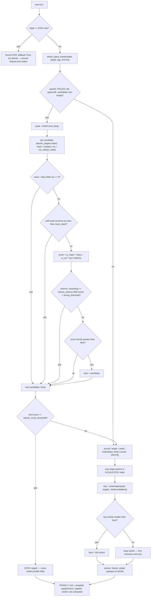

# PRD: Police Strategy — Pursuit & Barrier Decision Policy Under Partial Observation

## 1. Overview & Context

### 1.1 Purpose

The police strategy is the decision policy of the Police peer: on every own turn it selects
exactly one action from this peer's own local state (CT-01) and the belief board's snapshot
of the hidden Thief position (M-02 — specified in `docs/PRD_belief_board.md`, the sibling
shared part of this stage) — either an orthogonal move, or a **barrier placement** that
forfeits the move (GAME-006) and is decided by the named pure function
`where_place_barrier` (FR-P2) — and only afterwards produces the outgoing verbal hint
(template mode by default). The policy exists to capture the Thief within the signed move
cap (35 rounds, GAME-014) using at most 14 public barriers (GAME-008), while the Thief
evades from the same belief peak and can end the game from its own side of the board
(rules 46/47 — GAME-010/GAME-011, visible only to the Thief).

This is the **role-specific part** of the Stage-3 Perception & Strategy work. The belief
board (the inference half) is identical in both role repositories and is specified
separately in `docs/PRD_belief_board.md`; the policy that consumes it is role-specific and
lives here (Police) and in `thief_repo/docs/PRD_thief_strategy.md` (Thief, delivered). The
**shared core** of the strategy module — the `Decision` contract, the `BrainBase` phase
discipline, the verbal `HintWriter`, and the injection seam — is specified in the clearly
marked shared-core sections below (FR-P6, FR-P7, FR-P9 and the §5 output table) and must
stay mutually consistent between both role documents; the ORC sync-checks it after every
wave, the same rule that applies to the shared scent and belief modules.

This PRD decomposes the approved product contract for the Police strategy and implements
the mechanism PRD `docs/mechanisms/M-03-police-strategy.md` (binding) and the shared C02
component PRD. It makes the policy compatible with the **adopted operational
interoperability profile** (ADR-004: `wire_shape` `reference-v3`, scent
`subtractive_chebyshev_v1` default, `info_mode` belief) — the strategy's *output* is
private (no cross-team byte agreement on moves, hints, or barrier timing, SPEC §1), but
the wire fields the decision flows into must respect the pinned surface (§10).

**Stage numbering note (stated once).** Book ch. 10 splits stage 3 ("blind strategy") from
stage 4 ("language and scent"). This project folds them: the scent model (book stage 4) was
delivered early (T005), so this single Stage 3 delivers the strategy module on top of a
working scent + belief pair. The belief half is the sibling shared trio
(`PRD/PLAN/TODO_belief_board.md`); this document is the strategy half.

**Prerequisites (assumed delivered, per stage entry criteria).** Base board + domain rules +
config (C01, T003/T004); scent model + lock (T005); orchestrator state machine + turn loop
(T010); MCP transport + turn frames (T009); integrity core (T008). The stage-2 role glue
carries a **stand-in decision engine** (PLAN-MCP-INFRA SD-03: `legal_moves[0]` + a canned
hint) that this stage replaces on the decision path. The belief board (T006) is the sibling
stage-3 work and is an entry criterion for the spine swap (TODO PS-04).

### 1.2 Problem Statement

Each peer knows only its own position (STRAT-001). The Police never sees the Thief; what it
can use each turn is:

- the **belief snapshot** about the Thief position — `most_likely()`,
  `peak_probability()`, `top_k()`, `prob(cell)` (PRD-BELIEF-BOARD FR-B6);
- the **last received scent field** (raw channel, decaying and stale, `hottest()` helper of
  the delivered scent module) — for fallback when the belief is too diffuse to trust;
- its **own barrier ledger** — placements so far against the signed quota of 14
  (GAME-008), and the resulting public barrier list: barriers are impassable to **both**
  agents for the rest of the game (GAME-007) and are exact, truthful, and open (GAME-012).
  The barrier list is the policy's own investment record, not opponent truth.

The policy must therefore:

- Select **only from the CT-01 legal-action set** (orthogonal moves in fixed order, then
  `STAY`), or from `STAY` plus a **legal barrier target** (`barrier_targets()`: own cell +
  unblocked orthogonal neighbours, in-bounds, quota remaining); it never invents an action
  (M-03 `{#pursuit_legality}`).
- Move **toward where the Thief is believed to be** (book ch. 6 §6.4: the cop minimizes
  Manhattan distance to the belief peak; the thief maximizes it). "Commit to the peak"
  falls out for free: when the peak is adjacent, the minimizing action steps onto it, and
  the runtime then attaches the truthful `capture_claim` = Police position to the outgoing
  message (GAME-009; the Police cannot *know* it captured — the Thief's honest answer,
  SEC-007, resolves it).
- Decide **whether and where to place a barrier** this turn via the named pure function
  `where_place_barrier` (FR-P2) — budgeted (quota, GAME-008), topology-aware (region
  collapse of the peak's reachable area), and self-route-safe (never sever its own pursuit
  by more than a tunable slack).
- **Declare every barrier openly and exactly in the same turn** it places it (GAME-012,
  M-03 `{#barrier_honesty}`) — a hidden or false declaration is disqualifying; the
  placement forfeits the move (GAME-006).
- Keep the **capture exchange truthful** (SEC-007): the claim is the runtime's mechanical
  job on a MOVE (the Police's own revealed position — honest by construction); the
  rule-46/47 endings (GAME-010/GAME-011) are visible only to the Thief and **must be
  announced by the Thief** or the game forks (SPEC §3.1). The policy has no claim field and
  no path to the claim answer — `answer_capture_claim` is Thief-only domain code.
- **Fall back sensibly when the belief is diffuse** — a peak with probability below a
  confidence floor (default 0.10) is a noisy point estimate; the policy degrades to the raw
  scent channel, then to the board centre, so `decide()` is total (it never has no target).
- Stay **deterministic** (same seed + same wire transcript ⇒ identical decisions) and
  **fast** (≤ 10 ms p99 including the barrier pipeline — pure Python, no model call,
  book ch. 6 §6.2/§6.5).
- Produce a hint that is **free natural language** (NET-003/NET-004), arena-bounded, within
  the signed word cap, **truthful or deceptive** (STRAT-009), and **isolated from
  movement** (M-03 `{#hint_isolation}` — a hint can never influence an already-selected
  action, barrier included).

### 1.3 Theoretical Background

The setting is a decentralized partially observable stochastic game (Dec-POMDP, book ch. 6
§6.4): the Police's policy is a function of its belief state and own local state, never of
the global state. The belief board (PRD-BELIEF-BOARD) is a grid-based Bayesian filter over
the cell set; this PRD is the **policy** on top of it — a deterministic ranking over the
legal action set plus one budgeted investment decision (the barrier).

**Pursuit as a two-key ranking.** With the shipped orthogonal move set, Manhattan distance
is the admissible step estimate (book ch. 6 §6.4, `D = |xc−xt| + |yc−yt|`); the book's own
worked example (cop at (2,2), peak at (5,5): both East and North give D=5, West gives 7 —
"choose the eastern or northern move") is exactly a minimum over the legal list. The policy
ranks every legal action's destination by the key `(d, -belief.prob(dest))` and takes the
**first minimum** in CT-01 order (N, S, W, E, STAY):

1. **Distance** — minimize Manhattan distance from the destination to the *target cell*
   (the believed Thief position; the target-selection rule in FR-P3). The primary pursuit
   term; the book's symmetric recipe (cop minimizes, thief maximizes).
2. **Likelihood (secondary key)** — among equidistant destinations, prefer the likelier
   cell (`-belief.prob(dest)`): two cells at the same distance are not equally good bets
   when the belief is asymmetric. This is the one extra key the reference's pure distance
   `min` lacks, and it is police-specific — the Thief doc's SD-T6 records the symmetric
   rejection of importing it into the evasion policy. No lookahead: both keys are O(1) per
   action (book §6.3.1's "your own heuristic algorithm" route).

**Barrier placement as a budgeted one-shot topology investment.** A barrier is irreversible
and impassable to both (GAME-007) — in pursuit–evasion terms it is a *cut*: it permanently
removes cells from the Thief's reachable set. With a finite quota (GAME-008), placement is
a budgeted greedy decision; the reference implementation spends that budget with a belief-
and-topology-blind roll (`rng.random() < 0.15` every turn — report §5.2/§10 item 5: "a
basic default … students improve placement"). This policy replaces the roll with
`where_place_barrier` (FR-P2), a pure function with a fixed pipeline:

1. **Guards** — Police role, quota remaining, non-empty `barrier_targets()`; else `None`
   (move instead).
2. **Per-candidate value** (candidates in `barrier_targets()` order — own cell first, then
   unblocked orthogonal neighbours): `mass = belief.prob(c)` (a barrier on the believed
   Thief cell is a rule-46 capture the Thief must honestly acknowledge, GAME-010) plus
   `cut` — the collapse of the peak's reachable region, computed as a BFS flood-fill of
   `reachable(peak, barriers)` before vs. after adding `c`; a candidate **on the peak**
   collapses the whole region (`cut = before`) and carries the rule-46 gamble.
3. **Skip rules** — no value (low mass and zero cut), self-route violation (the barrier
   worsens the Police→peak BFS distance by more than `route_slack` — never sever your own
   pursuit), and quota reserve (with little quota left, only a *strong* score places —
   save the last barriers for the late game, when a cut converts pursuit into forced
   capture).
4. **Threshold** — the best candidate is returned only if its score clears
   `barrier_score_threshold`; otherwise the policy moves.

The weighted score `w_mass * mass + w_cut * (cut / before)` with config-owned values
(PRD §9) is **derived design / project convention**, not an official requirement: M-03
marks the pursuit/barrier priorities as "derived design, not an official requirement", and
PLANQ-008 (`TBD_TEAM_DECISION`) records the approved heuristic priorities and seeded
scenarios. The values in §9 are the baseline that PLANQ-008 approves or revises; the task
proceeds in the meantime (`blocks: criterion`, not `blocks: start`).

**The three movement-policy routes** (book ch. 6 §6.3/§6.3.1, presented as equal citizens):
(1) pure Bayes + Manhattan heuristics — the reference default; (2) "your own heuristic
algorithm" — richer deterministic policy; (3) RL (Q-learning, Bellman updates, ε-greedy) —
explicitly optional and not taught in the course. This stage implements route (2): the
two-key pursuit plus the budgeted barrier pipeline, with route (1) kept as the A/B
baseline in the KPI harness (report §10: "replacing it is the assignment"). RL and
lookahead remain P2 options (STRAT-007 says none is required).

**The verbal layer** (book ch. 6 §6.5/§6.5.1) is separated from space by the same module
boundary (ARCH-007): the LLM — if configured at all — writes text only; the move and the
barrier are chosen entirely by pure Python ("space → algorithm, words → (optional) LLM",
report §1). The recommended default is the zero-token **template** mode (STRAT-008 SHOULD;
book §6.5.1's four provider tiers: template → ollama → claude_api → claude_cli; an
optional provider adapter is T027, P2, and out of scope for this stage — only the
provider-neutral seam is defined). Hints may lie (STRAT-009 MAY): the template Police
asserts its own location using the arena's landmark names (line style: "I'm just off
{landmark}.") and lies with probability ≈ 0.4 through the seeded RNG (reference behaviour,
report §5.4), naming a landmark it is not near; the sealed `verdict` ("truth"/"lie") is
computed locally from the role's own position, so it is always well-defined and auditable.

### 1.4 Target Audience

The peer runtime (C04 turn loop — calls `decide()` once per own turn and applies the
result, including `place_own_barrier` for a set `barrier_cell`), C03 (seals the decision's
commit fields — move, barrier, verdict, prompt text — into the per-step commit chain,
SPEC §3), the test suite (property tests for legality, KPI self-play harness,
determinism/latency), the project team (approval baseline for PLANQ-008), and the
evaluator (audits against M-03's acceptance scenarios). The Thief strategy document
(`thief_repo/docs/PRD_thief_strategy.md`, delivered) reads the shared-core sections as its
mirror.

## 2. Goals & Success Metrics

### 2.1 Goals

1. One deterministic Police policy in `src/police_peer/strategy/` that selects only from
   the CT-01 legal set — or, via `STAY`, a legal barrier target — and never invents an
   action (M-03 `{#pursuit_legality}`, CT-01).
2. Barrier placement is decided by one named pure function, **`where_place_barrier`**
   (FR-P2): it decides **whether** to place a barrier this turn and **where** (from
   `barrier_targets()`), respects the quota (GAME-008), never severs its own pursuit
   beyond `route_slack`, and reserves late quota for strong plays.
3. The policy consumes the belief board and **materially influences** selection
   (STRAT-006) — peak-chasing pursuit when confident, scent fallback when diffuse,
   demonstrated by fixtures and by the KPI harness.
4. Zero-token template hints by default, isolated from movement (STRAT-008, M-03
   `{#hint_isolation}`); a slow or failing text generator can never block or select the
   action (CT-02 failure behavior).
5. The stand-in decision engine (PLAN-MCP-INFRA SD-03) is replaced by the real brain on
   the decision path with the spine green after every swap (PLAN §12).
6. Determinism: same seed + same wire transcript ⇒ byte-identical decision logs; decision
   latency p99 ≤ 10 ms including the `where_place_barrier` pipeline on the shipped 7×7
   board.
7. The shared-core files (`strategy/decision.py`, `strategy/base.py`, `strategy/hints.py`,
   `strategy/inject.py`, `strategy/__init__.py`) remain mutually consistent with the Thief
   repo's counterparts modulo package import path and the role constant (shared-code rule).

### 2.2 Success Criteria (Milestones)

| ID | Milestone | Evidence |
|---|---|---|
| MS-1 | Shared core built | `Decision`, `BrainBase`, `HintWriter`, injection seam constructible and unit-green: TC-P01, TC-P17, TC-P19 (partial) |
| MS-2 | Pursuit + barrier policy built | `PoliceBrain` + `where_place_barrier` unit-green: TC-P02 (unit level), TC-P03…P13, TC-P18 |
| MS-3 | Belief materially influences selection | TC-P03 (all four pursuit branches) + A/B fixtures: same brain, swapped belief peak vs. uniform belief ⇒ different actions in the pursuit fixtures; confident belief ⇒ distance-minimizing behaviour toward the peak |
| MS-4 | Real brain in the loop | Spine swap (PLAN §12 S3a/S3b/S3c): TC-P23 — `tests/integration/test_series_loopback.py` green with the real Police brain on Police sub-games |
| MS-5 | KPI + determinism close-out | TC-P20, TC-P21, TC-P22 pass; coverage ≥ 85% on `strategy/` |

### 2.3 KPIs

Project-set (not official) targets, measured by a seeded self-play harness (role-pinned
Police sub-games, shipped 7×7 config; the opponent is the reference `ThiefBrain` test
double — registered evidence, non-authoritative):

| KPI | Target |
|---|---|
| Police capture rate within 35 rounds vs reference `ThiefBrain` (20 seeded games) | ≥ 60% |
| Police median rounds-to-capture (vs reference Thief) | ≤ 28 |
| Police captures using ≤ 8 barriers (quota economy — the designed policy saves quota, unlike the 0.15 roll baseline) | ≥ 50% |
| Illegal actions across 10k fuzzed `decide()` calls (property test: action legality + barrier candidacy) | 0 |
| Decision latency p99 (Police `decide()` **including `where_place_barrier`**, 7×7, CPython 3.12) | ≤ 10 ms |
| Determinism: two runs, same seed + same wire transcript | byte-identical decision logs |
| Coverage on `strategy/` / line cap / ruff | ≥ 85% / 0 files over 150 / clean |

## 3. Functional Requirements

### FR-P1 — Legal-set-only selection and barrier candidacy (M-03 `{#pursuit_legality}`, CT-01, STRAT-001, GAME-006/GAME-008)

The policy iterates exactly the CT-01 legal list — orthogonal moves in the fixed
`N, S, W, E` order, `STAY` last (`Board.legal_moves`) — and returns one member of it, or
`STAY` together with a barrier target drawn **only** from `state.barrier_targets()`
(own cell + unblocked orthogonal neighbours, in-bounds, quota remaining). It never
invents an action, never places a barrier on a non-candidate cell, and never depends on
the opponent's true position. When the legal list is exactly `["STAY"]` (all orthogonal
moves blocked), the policy returns `("STAY", None)` with `fallback=True` and
`where_place_barrier` is **not consulted** (the pinned shared-core phase order,
FR-P6/FR-P7 mirror); whether that state ends the game is decided on the Thief's side of
the board (rules 46/47 — GAME-010/GAME-011), not here.

### FR-P2 — `where_place_barrier`: the pure barrier decision function
**(derived design — M-03 "derived design, not an official requirement"; PLANQ-008; GAME-008)**

The decision *whether to place a barrier this turn and where* is a single **pure,
deterministic function** in its own module (`strategy/barriers.py`):

```python
def where_place_barrier(state: GameEngine, belief: BeliefGrid, cfg: Mapping[str, object]) -> Cell | None:
    """Decide WHETHER to place a barrier this turn and WHERE (from barrier_targets()).
    Returns the target cell, or None (= move instead). Pure, deterministic."""
```

Pipeline (fixed order; every step testable in isolation):

1. **Guards** (else `None`): role is POLICE; `barriers_placed < barriers_max`;
   `candidates = state.barrier_targets()` non-empty (CT-01: own cell + orthogonal
   neighbours, in-bounds, unblocked).
2. `peak = belief.most_likely()`.
3. Per candidate `c` (`barrier_targets()` order — own cell first, then unblocked
   orthogonal neighbours in `N, S, W, E` order):
   - `mass = belief.prob(c)` — a barrier on the believed Thief cell is a rule-46 capture
     (GAME-010) the Thief must honestly acknowledge;
   - `cut = cut_value(state, c, peak)` — the BFS flood-fill of the peak's reachable region
     with the current barriers vs. with `c` added (orthogonal neighbours, barriers
     impassable); if `c == peak`: `cut = before` (full region collapse plus the rule-46
     capture gamble);
   - **skip** if `mass < cfg.barrier_mass_floor` (default 0.05) and `cut == 0` (no value);
   - **self-route check**: BFS distance Police→peak with the current barriers vs. with `c`
     added; **skip** if it worsens by more than `cfg.route_slack` (default 1) — never
     sever your own pursuit;
   - `score = cfg.w_mass * mass + cfg.w_cut * (cut / before)` (defaults 1.0 / 0.5);
   - **reserve**: if `remaining = barriers_max - barriers_placed <= cfg.barrier_reserve`
     (default 3) and `score < cfg.strong_threshold` (default 0.8) → **skip** (save the
     last quota for the late game);
   - keep the best (strictly-greater comparison → the first candidate wins ties,
     deterministic).
4. Return the best iff its score ≥ `cfg.barrier_score_threshold` (default 0.3), else
   `None` (move instead).

The function is pure — no engine mutation, no RNG, no clock: the **strategy never calls
`place_own_barrier`**; it returns a target and the C04 glue applies it (S3a, PLAN §12),
so the domain re-checks role/quota/candidacy at the boundary (`place_own_barrier` raises
otherwise).

### FR-P3 — Scored pursuit ranking with diffuse fallback (STRAT-006)

The pursuit target per turn is, in fixed order:

1. `belief.most_likely()` when `belief.peak_probability() >= min_confidence` (private
   config, default 0.10) — confident belief ⇒ chase its peak;
2. else `scent.hottest(last_received_field)` (delivered scent-module helper, lexicographic
   tie-break) — diffuse belief ⇒ the raw scent channel (symmetric with the Thief's
   fallback; a serpentine board-sweep is explicitly P2/out of scope — §6.2);
3. else the board centre — empty field ⇒ the decision is still total.

Each legal action's destination is then ranked by the key `(d, -belief.prob(dest))` and
the **first minimum** in CT-01 order is selected (strict smaller-than comparison while
scanning — deterministic tie-break, the reference's own `min`-first-extremum convention,
report §5.2):

```
d          = manhattan(dest, target)        # MINIMIZE (distance to believed Thief)
secondary  = -belief.prob(dest)             # equidistant ⇒ the likelier cell
```

"Commit to the peak" falls out for free: when the target is adjacent, the minimizing
action steps onto it (`d = 0`), and the runtime then attaches
`capture_claim = Police position` to the outgoing message (Police + MOVE, per
CT-03/turn-sender, assumed delivered) — the Police cannot *know* it captured (hidden
state); the honest claim + the Thief's truthful answer + the audit resolve it
(GAME-009, SEC-007). `STAY` is a legitimate pursuit outcome: at the target cell itself,
`STAY` has `d = 0` and beats every move away — the Police can hold a cell while the
belief settles.

### FR-P4 — Barrier turn mechanics: forfeit, open declaration, same turn
**(GAME-006, GAME-007, GAME-012, M-03 `{#barrier_honesty}`)**

On a target from FR-P2, `_decide_move` returns `("STAY", target)` — the book's
move-forfeiting barrier mechanic (GAME-006: placing a barrier forfeits movement that
turn). The C04 glue then (i) applies `engine.place_own_barrier(target)` (domain
re-checks role, quota, candidacy) and (ii) **declares** `barrier_placed = [r,c]` on the
outgoing wire frame in the **same turn** — open and exact (GAME-012, rules 15–16): a
hidden or false declaration is disqualifying, and the declaration is the runtime's
mechanical job from the `Decision` field, not a policy choice. The barrier is
irreversible and impassable to both sides (GAME-007); the opponent applies it via
`observe_barrier` (quota-checked). The own cell **is** a legal candidate (the domain
allows it — waling a corridor behind oneself; it also blocks the Thief from entering the
Police's cell); the FR-P2 score decides whether it is worth it.

### FR-P5 — Truthful capture exchange is outside the policy's answer path
**(SEC-007, GAME-009, M-03 capture-claim binding)**

The Capture Claim is issued by the **runtime/C03** on a Police MOVE (the claim is the
Police's own revealed position — truthful by construction, GAME-009) and sealed into the
commit chain; the rule-46/47 endings (GAME-010/GAME-011) are visible **only to the
Thief** and must be announced by the Thief or the game forks (SPEC §3.1 — two honest
peers, two different stories, rule-35 zero). The policy implements no part of the
exchange: `Decision` has no claim field, and no policy method reads or writes one;
`answer_capture_claim` is Thief-only domain code that this peer never calls. The
policy's only obligations are the negative ones — never gate, delay, or suppress the
game-ending final on policy grounds, and keep claiming honest by staying on cells it can
defend (the pursuit does that).

### FR-P6 — Verbal hint: template default, arena-bounded, capped, declared verdict
**(STRAT-008, STRAT-009 — shared core, mirrors the Thief role doc)**

- `HintWriter(role, rng, arena, max_words)`; **template mode is the default** — zero tokens,
  fully offline, the book-recommended route (book §6.5.1; STRAT-008 SHOULD).
- Template line banks per role (3–4 truth/lie variants each) in the shared core; hints
  **assert the speaker's own location** using landmark names **imported from
  `belief.hints.LANDMARK_CELLS`** (SD-B3 of PLAN-belief-board — one table, both directions;
  never a copy). The receiver's belief board interprets an incoming hint as a claim about the
  sender, which is why this composition works end-to-end.
- The template lies with probability ≈ 0.4 through the **seeded** RNG (reference behaviour):
  a lie asserts a landmark region the role is not in (and not Chebyshev-adjacent to). If no
  landmark region contains or is Chebyshev-adjacent to the position, the truth branch falls
  back to a generic non-landmark line (no claim, verdict "truth").
- The **verdict is computed locally**: `"truth"` iff the asserted landmark region contains
  (or is Chebyshev-adjacent to) the role's actual position — the role knows its own position,
  so the verdict is well-defined for both roles and always matches the sealed audit record.
- Output is truncated to `hint_max_words` (signed, shipped 15) by `_cap`; for LLM providers
  (T027) the arena and the cap also go into the system prompt (reference behaviour).
- Hints are free-form natural language (NET-003) — never a disguised coordinate (NET-004).

### FR-P7 — Hint isolation and LLM exclusion from movement
**(M-03 `{#hint_isolation}`, NG-003, CT-02 failure behavior — shared core)**

The phase order is **pinned** in `BrainBase.decide()`: **move first, hint second** — the hint
can never influence an already-selected move. `_decide_move` is pure Python and the LLM is
**never consulted** on the movement path (NG-003: an LLM must not bypass deterministic
legality; book ch. 6 §6.5 warning box). Any optional provider call that is slow, fails, or
returns unparseable text falls back to the template **without touching the already-selected
action** (CT-02 failure behavior; book §6.5.1 deadline + fallback), so banter can never
stall the game. For the Police, "the already-selected action" includes the barrier target:
`where_place_barrier` runs inside the move phase, before the hint (TC-P15 pins it).

### FR-P8 — Role-local visited set in BrainBase (shared core; Police does not consume it this stage)

`BrainBase` owns `visited: set[Cell]` — initialized to `{start}` per sub-game, a destination
added **only on an orthogonal MOVE** (not `STAY`), never serialized, never sent, reset on
sub-game start. This repo's `GameEngine` has no visited set; the field exists in the shared
core so both role brains share one base (the Thief policy consumes it for its freshness term,
that doc's FR-T8). The Police pursuit policy (FR-P3) does **not** consume it this stage — no
pursuit term needs it — and a future Police freshness/sweep term (P2) could start reading it
without a shared-core change. Being role-local evidence, it respects STRAT-001/OBS-002.

### FR-P9 — Injection seam: config-selected brain, fail-fast
**(ARCH-007, book ch. 6 §6.2 — shared core)**

- Private config `[strategy] police_class` (and `thief_class` in the mirror) carries an
  optional dotted `"package.module:ClassName"` selector; `resolve_brain_cls(config, role)`
  is **fail-fast**: `ValueError` on a malformed selector or missing attribute, `TypeError` if
  the target is not a `BrainBase` subclass.
- `resolve_brain(config, role, llm, rng)` instantiates the resolved class with the seeded
  RNG (default: the resolved config's seed), the arena, the signed word cap, and the
  template `HintWriter`. The C04 runtime **never hard-codes** a brain (reference
  `runtime.py` L73 pattern; book §6.2: the module is chosen in the private config's
  `[strategy]` section). With `[strategy]` unset, the shipped role brain of this stage runs
  — POLICE sub-games run `PoliceBrain`; the opposite-role default is recorded in PLAN SD-P7.
- The brain is resolved **per sub-game role** (roles alternate across the series,
  `role_for`), so the seam takes the played role, not the peer's natural role.

### FR-P10 — Determinism and seeding discipline (STRAT-007, NFR-2)

Every decision is a pure function of (engine state, belief snapshot, last received field,
config, seed-derived RNG stream). No wall clock and no environment read enter the decision
(`response_seconds` is measured metadata, not an input). The `where_place_barrier` pipeline
adds no stochasticity: candidate order is the pinned `barrier_targets()` order and the best
candidate is the first strictly-greater maximum. Given an identical sub-game wire
transcript and seed, two runs produce byte-identical decision logs (action, barrier,
hint, verdict, fallback at every step).

### FR-P11 — No hidden-truth leakage (STRAT-001, OBS-002)

No constructor, method, or field of any strategy module accepts the opponent's actual
position, the opponent's role-internal state, or any value only derivable from them. The
evidence surface is: CT-01 local state (including the Police's **own** barrier ledger),
the belief snapshot (already a pure inference product), the received scent field, the
received hint text, the signed config. A static test (mirror of belief TC-B12 and of the
Thief doc's TC-T14) asserts no import of opponent-truth symbols into `strategy/`.

### 3.1 User stories

- **As the runtime**, I call `decide(engine, belief, last_hint, arena)` once per own turn
  and get back a legal action — or `STAY` plus a legal barrier target — plus a hint in
  microseconds (the `where_place_barrier` pipeline included); the LLM's availability is
  not part of my timing.
- **As the auditor**, I can recompute the sealed `verdict` from the role's own revealed
  position and the asserted landmark; I can prove every placed barrier has its open,
  exact, same-turn declaration on the wire (M-03 `{#barrier_honesty}`); and I can prove
  the move phase never saw the hint.
- **As the evaluator**, I can point at M-03's three acceptance scenarios
  (`{#pursuit_legality}`, `{#barrier_honesty}`, `{#hint_isolation}`) and at the property
  tests that prove each, without reading the Thief code.
- **As the Thief peer across the wire**, I receive hints that may be lies and scent that
  cannot — and every barrier the Police drops is declared in the same turn, so my belief
  board excludes them as public truth; nothing this policy emits is a numeric position.

## 4. Non-Functional Requirements

### NFR-1 — Performance

`decide()` (both phases, template mode, **including the full `where_place_barrier`
pipeline**) ≤ 10 ms p99 on a 7×7 board, CPython 3.12, laptop-class CPU. The pursuit scan
is ≤ 5 destinations × O(1) queries; the barrier pipeline is ≤ 5 candidates ×
(two flood-fills + two BFS distances over ≤ 49 cells) — O(candidates × board cells), a
few hundred primitive operations on the shipped board. An optional provider call (T027,
out of scope) is deadline-bounded outside this budget by CT-02's failure behavior.

### NFR-2 — Determinism

Identical inputs ⇒ identical outputs, every run (FR-P10). No wall clock, no dict-order
dependence beyond the pinned CT-01 action order, the pinned `barrier_targets()` candidate
order, and sorted/seeded iteration where order matters, no hash-seed dependence. The lie
roll and any other stochasticity run on the injected seeded RNG only.

### NFR-3 — Testability

The module is testable with plain data (no transport, no config file on disk): config
arrives as constructor arguments / the `cfg` mapping, the belief and the engine arrive as
objects. `where_place_barrier` is a pure function, so **every pipeline step is testable in
isolation** (guards, no-value skip, self-route skip, reserve skip, threshold, tie order).
Property tests drive the brain with random-but-seeded (engine, belief, field) fixtures;
the KPI harness drives it over the delivered loopback spine with a reference-baseline
opponent (test double, not the real Thief peer).

### NFR-4 — Configurability

Adjustable values live in private config only: `[strategy]` (selector) and
`[strategy.police]` (pursuit floor + barrier weights/thresholds — §9). Shared signed
values (board size, move set, barrier quota, move cap, survival threshold, arena, word
cap) are consumed, never overridden. Private config can never weaken a signed value
(CFG-006 precedence: on any key conflict the shared JSON overlays the private TOML).

### NFR-5 — Security and separation

No secrets, no credentials, no environment reads in `strategy/`. No import path may reach
the opponent's local truth (FR-P11's static test) or the network layer. The optional
provider (T027) is isolated behind the `TextProvider` Protocol and the Gatekeeper (SEC-009
token metering is C03/C06 territory, consumed not computed here).

### NFR-6 — Modularity and dependency discipline

`strategy/` depends only on `common.domain` (Board geometry, `Cell`, `manhattan`,
`GameEngine`, `Role`), `police_peer.belief` (snapshot queries + the `LANDMARK_CELLS`
table, SD-B3 import) and `police_peer.scent` (the `hottest` helper) — nothing else: not
the wire, not the transport, not the GUI. The shared-core files are identical in both
role repositories modulo package import path and the role constant (the
shared-scent/belief precedent); the ORC sync-checks after every wave that touches them.
Files stay under the 150-line cap; no speculative abstractions (one frozen dataclass,
one base class, one writer, one seam, one pure barrier module, one role brain).

## 5. Expected Input / Output

### 5.1 Input (per sub-game construction)

| Input | Source | Notes |
|---|---|---|
| own role for the sub-game + start cell | CT-01 / `role_for` (signed starts) | brain is reset per sub-game: `visited = {start}`, `last_field = {}` |
| board (signed size 7) | CT-01 / shared game.json | geometry only; the policy never forks it |
| private `[strategy]` / `[strategy.police]` config | private game.toml | §9; selector + pursuit floor + barrier weights/thresholds |
| arena (`world.map_area`, shipped "New York") + `hint_max_words` (signed 15) | shared game.json | hint content bounds (STRAT-009) |
| seed | resolved private config | the injected `random.Random` (FR-P10) |

### 5.2 Input (per own turn, to `decide()`)

| Input | Source | Notes |
|---|---|---|
| `state: GameEngine` | CT-01 local state | `legal_moves()`, `barrier_targets()`, `position`, `barriers`, `barriers_placed`, `barriers_max`, `board` — own truth + own barrier ledger only |
| `belief: BeliefGrid` snapshot | PRD-BELIEF-BOARD FR-B6 (via the C04 turn loop) | `most_likely()`, `peak_probability()`, `prob(cell)`; read after the turn's update |
| last received scent field | CT-03 `smell_grid` (via the C04 `note_evidence` hook, PLAN SD-P5) | `{"r,c": float}`; diffuse fallback only (FR-P3) |
| `opponent_hint: str` | CT-03 `hint` (last received) | **verbal phase only** — never a move or barrier input (FR-P7) |
| `arena: str` | shared game.json | hint content |
| `deadline: float | None` | C04 | template mode ignores it; provider mode (T027) bounds the call |

### 5.3 Output

| Output | Consumer | Notes |
|---|---|---|
| `Decision` (frozen dataclass, table below) | C04 turn loop (applies `action` and, when set, `place_own_barrier(barrier_cell)`), C03 (seals commit fields) | the CT-02 response; additive-only contract |
| `Decision.hint` | CT-03 `TurnMessage.hint` | ≤ 15 words, free NL, may lie (STRAT-009) |
| `Decision.action` + `barrier_cell` + `verdict` + `prompt_text` | commit preimage via C03 (canonical JSON, SPEC §2) | plain serializable values only |

| Field | Type | Notes |
|---|---|---|
| `action` | `str` | one member of the CT-01 legal set (incl. `"STAY"`) |
| `barrier_cell` | `Cell | None` | legal `barrier_targets()` cell under quota when set (FR-P2); requires `action == "STAY"` (GAME-006 forfeit); always `None` for Thief (that doc's FR-T4) |
| `hint` | `str` | ≤ `hint_max_words` words (FR-P6) |
| `verdict` | `str` | `"truth" \| "lie"` — sealed into the commit chain (SPEC §3) |
| `fallback` | `bool` | `True` when forced `STAY` (legal set was `["STAY"]` only) |
| `reasoning` | `str` | `""` for template mode |
| `prompt_text` | `str` | sealed (`prompt_discussion`) for audit; `""` for template mode |
| `response_seconds` | `float` | timing metadata for the hint phase; never a decision input |

## 6. Constraints & Limitations

### 6.1 Constraints

- The policy selects only from the CT-01 legal set, or `STAY` + a `barrier_targets()`
  cell (M-03 binding, GAME-006/GAME-008); legality and candidacy are guaranteed upstream
  and re-checked at the domain boundary (`apply_own_move` / `place_own_barrier` raise
  `IllegalMoveError`) — the policy does not reimplement physics.
- Signed values are fixed and consumed, never redefined: 7×7 board, move set
  `N,S,E,W,STAY`, barrier quota 14 (GAME-008), move cap and survival threshold 35
  (GAME-014), arena "New York" and 15-word cap (STRAT-009 defaults).
- Barriers: placement forfeits the move (GAME-006); barriers are irreversible and
  impassable to both (GAME-007); every placement is declared openly and exactly in the
  same turn (GAME-012) — the `("STAY", target)` shape is the **only** placement path, so
  a hidden barrier is structurally impossible from this policy (M-03 `{#barrier_honesty}`).
- The capture exchange is runtime/C03-owned and always truthful (SEC-007, GAME-009,
  FR-P5); the rule-46/47 endings (GAME-010/GAME-011) are Thief-visible only — the Police
  never learns a barrier-induced capture from its own state.
- `step` numbering is per-peer and a step is a **round** (SPEC §7.5): the policy reads
  only its own `engine.step` and never the opponent's counter.
- Movement and barrier selection never depend on an unvalidated LLM output (NG-003,
  STRAT-008); the book's single LLM-tactics exception (explicit documented mutual
  agreement + local legality enforcement) is **out of scope** for this stage.
- Line cap 150 nonblank/noncomment lines per code file; no new third-party dependency
  (pure stdlib + the existing repo packages).

### 6.2 Limitations (accepted)

- **Single-step greedy, no lookahead.** The target is a point estimate, not a
  distribution over the Thief's next move; a feinting Thief (a hint lie, a loop back
  toward the cop) keeps the peak stale for a turn or two. Lookahead (minimax/expectimax
  over the opponent belief — including barrier lookahead, book §6.3.1) is the P2 upgrade
  if self-play shows pursuit lag.
- **The barrier decision is one-shot greedy.** `cut` measures the *immediate* region
  collapse, not the multi-turn squeeze it sets up; the quota reserve (FR-P2 step 3) is a
  fixed proxy for late-game value, not an optimization. The `≤ 8 barriers` KPI (PRD
  §2.3) is the measurable economy check.
- **The diffuse fallback can sit on a stale hotspot.** Under the default one-sided
  `trust_v1` likelihood (PRD-BELIEF-BOARD §6.2) an empty received field carries no
  negative evidence; `scent.hottest` inherits that staleness. A serpentine board-sweep in
  diffuse mode is explicitly **P2/out of scope** (recorded decision — the fallback stays
  symmetric with the Thief's `hottest` fallback).
- **The Police cannot know a capture.** Rule-46/47 endings (GAME-010/GAME-011) depend on
  the Thief's announcement (SPEC §3.1); until that final arrives, the Police's own state
  shows nothing terminal. The policy's contribution is to make the endings likely
  (commit to the peak; cut the peak's region) and to keep its own claim path honest.
- **`visited` is role-local per sub-game** and unconsumed by the Police policy this stage
  (FR-P8); there is no cross-sub-game or series-level learning (T019 territory).
- **The lie rate is a fixed seeded constant (≈ 0.4)**, not adaptive; deception quality is
  a game-theory concern of the pair, not a correctness concern of the policy (STRAT-009
  allows either).
- **The opposite-role sub-game** (series role alternation, `role_for`) keeps the stage-2
  stand-in selection in this repository until the thief stage's brain is ported (PLAN
  SD-P7); the KPI harness is role-pinned and unaffected.

## 7. Alternatives Considered

| Alternative | Trade-off | Verdict |
|---|---|---|
| **Reference chase + `rng.random() < 0.15` barrier roll** (report §5.2) | Simplest; byte-reproducible against the reference; but the roll is blind to belief *and* topology — it burns quota early, sometimes walls the Police's own corridor, and never saves the last barriers for the endgame. The report flags it: "a basic default … students improve placement" (§10 item 5) | **Rejected** as the final policy; **kept as the A/B baseline** in the KPI harness (the policy must beat it, not equal it) |
| **Scored pursuit + `where_place_barrier`** (two-key distance/likelihood ranking; budgeted mass + region-collapse barrier scoring; selected) | Pursuit terms O(1) per action; barrier pipeline O(candidates × cells) with a 49-cell board; no lookahead, no training; weights/thresholds are tuned project convention (PLANQ-008 records the approval); quota-aware, topology-aware, self-route-safe | **Selected** — book §6.3.1's "your own heuristic algorithm" route, the reference report's identified headroom (§10 items 2, 5) |
| **Full lookahead minimax / expectimax over the belief** (book §6.3.1) | Stronger play, including barrier lookahead; but needs a model of the Thief's policy (meta-belief), multiplies decision cost, and complicates the determinism/audit story | Rejected for this stage; **P2**, a new task if approved |
| **Q-learning RL** (book §6.3; STRAT-007 MAY) | The book's optional route (Bellman + ε-greedy); not required, not taught in the course; stochastic without a seeded discipline; training/eval burden over a 49-cell grid | Rejected for this stage; **P2**, a new task if approved |
| **LLM-driven movement/barrier** | The book's warning box (ch. 6 §6.5): coordinate hallucination turns directly into illegal or self-defeating moves (a barrier on the wrong cell is *irreversible* — the costliest kind of hallucination here); NG-003 forbids it by default; the single exception needs explicit documented mutual agreement | **Forbidden** for this stage by default; the exception is out of scope (stated) |

## 8. Success Criteria & Test Plan

### 8.1 One own turn (sequence)

```mermaid
sequenceDiagram
    participant RT as C04 turn loop (assumed)
    participant BE as BeliefGrid (belief stage)
    participant BR as PoliceBrain (shared core + M-03)
    participant HW as HintWriter (template)
    RT->>BE: apply_half_turn(smell_grid, hint, arena, own_cell)
    RT->>BR: note_evidence(smell_grid)      [last received field, SD-P5]
    RT->>BR: decide(state, belief, opponent_hint, arena)
    Note over BR: PHASE 1 — MOVE (pure Python, no LLM, NG-003)
    BR->>BR: legal = state.legal_moves()
    alt legal == ["STAY"] only
        BR-->>RT: Decision("STAY", fallback=True)  [forced; no barrier — pinned order]
    else
        BR->>BR: action, barrier = _decide_move(state, belief)
        Note over BR: barrier first: where_place_barrier(state, belief, cfg) (FR-P2)<br/>else pursuit scan: first min of (d, -prob) in CT-01 order (FR-P3)
        BR->>BR: visited updated on orthogonal MOVE
        BR->>HW: say(position)              [PHASE 2 — HINT, after the move]
        HW-->>BR: (hint, verdict)           [capped to 15 words; lie roll seeded]
        alt barrier not None
            BR-->>RT: Decision("STAY", barrier, hint, verdict)  [move forfeit, GAME-006]
        else
            BR-->>RT: Decision(action, None, hint, verdict, ...)
        end
    end
    RT->>RT: if barrier: engine.place_own_barrier(barrier); apply_own_move(action)
    RT->>RT: declare barrier_placed same turn (GAME-012); C03 seals (move, barrier, verdict, prompt)
    Note over RT: a hint can never alter the already-selected action or barrier (FR-P7)
```

### 8.2 Barrier decision and pursuit ranking (flow)



### 8.3 Specific test cases

| ID | Test | Criterion |
|---|---|---|
| TC-P01 | construction & smoke: build the brain from a config mapping; `decide()` on a fixture state returns a `Decision` whose `action` is in `state.legal_moves()` and whose `barrier_cell` is `None` or (when set) in `state.barrier_targets()` with `action == "STAY"` | FR-P1 |
| TC-P02 | legality property: 10k random (engine, belief, field) fixtures ⇒ `action` always in the legal set; `barrier_cell` is `None` or a legal candidate with `action == "STAY"` and quota respected; `fallback` is `True` iff the legal set was `["STAY"]` | FR-P1, FR-P4, MS-1/MS-2 |
| TC-P03 | pursuit: (a) confident peak ⇒ action minimizes `manhattan(dest, most_likely())`; (b) two equidistant destinations ⇒ the likelier (`belief.prob`) is selected; (c) peak below `min_confidence` + non-empty field ⇒ minimize distance to `hottest()`; (d) below + empty field ⇒ minimize distance to the board centre (boundary: exactly `min_confidence` ⇒ peak branch, `>=`) | FR-P3, MS-3 |
| TC-P04 | commit to the peak: target adjacent to the Police ⇒ the minimizing action steps onto it (`d = 0`); the capture claim itself is not asserted by the policy (runtime-owned, FR-P5) | FR-P3, GAME-009 |
| TC-P05 | tie-break: two actions with equal `(d, prob)` ⇒ the earlier in CT-01 order (N, S, W, E, STAY) wins | FR-P3, NFR-2 |
| TC-P06 | forced STAY: all orthogonal moves blocked ⇒ `("STAY", None)`, `fallback=True`; `where_place_barrier` is not consulted (pinned shared-core order); the rule-46/47 ending remains Thief-side domain-decided (no policy override) | FR-P1 |
| TC-P07 | `where_place_barrier` guards: non-Police role ⇒ `None`; quota exhausted (`barriers_placed == barriers_max`) ⇒ `None`; empty `barrier_targets()` ⇒ `None` | FR-P2, GAME-008 |
| TC-P08 | `where_place_barrier` value: a candidate with `mass < barrier_mass_floor` and `cut == 0` is skipped; `cut` computed by BFS flood-fill — a corridor candidate gives `before - after`; a candidate **on the peak** gives `cut = before` (region collapse + rule-46 gamble, GAME-010) | FR-P2 |
| TC-P09 | `where_place_barrier` self-route: a candidate whose addition worsens the Police→peak BFS distance by more than `route_slack` is skipped (never sever own pursuit); the guard is vacuous when the Police is already cut off from the peak | FR-P2 |
| TC-P10 | `where_place_barrier` reserve: with `remaining <= barrier_reserve`, a candidate with `score < strong_threshold` is skipped (quota saved) and one with `score >= strong_threshold` is placed | FR-P2, GAME-008 |
| TC-P11 | `where_place_barrier` threshold & tie: best score below `barrier_score_threshold` ⇒ `None` (move instead); at/above ⇒ the best target; two equal scores ⇒ the first candidate in `barrier_targets()` order wins (strictly-greater scan) | FR-P2 |
| TC-P12 | barrier turn mechanics: a target ⇒ `("STAY", target)` — the move is forfeited (GAME-006); the wire frame carries `barrier_placed = [r,c]` in the **same turn**, open and exact (GAME-012); the opponent applies it via `observe_barrier`; `barriers_placed` increments | FR-P4, M-03 `{#barrier_honesty}` |
| TC-P13 | capture exchange path: the claim is runtime/C03-attached on a Police MOVE (the Police's own position — honest by construction); `Decision` has no claim field; no strategy method calls `answer_capture_claim` (Thief-only domain, SEC-007/GAME-009) | FR-P5 |
| TC-P14 | template hint: output ≤ 15 words; names a landmark from the arena table (or the generic non-landmark line); `verdict` ∈ {truth, lie}; seeded lie fraction within 0.30–0.50 over 1000 generated hints (deterministic per seed) | FR-P6 |
| TC-P15 | hint isolation & NG-003: the move phase completes before the hint phase (a hint writer that raises or returns garbage leaves the action **and barrier** unchanged); a boom provider that raises if consulted is never consulted on the move path; a failed/deadline provider ⇒ template fallback with the action unchanged | FR-P7, CT-02 |
| TC-P16 | verdict rule: independently recomputed from position + asserted landmark region ⇒ matches the sealed `verdict` for every generated hint (rule: contains or Chebyshev-adjacent ⇒ "truth") | FR-P6 |
| TC-P17 | injection seam: explicit `police_class` selector loads the custom class end-to-end (`isinstance`); malformed selector ⇒ `ValueError`; missing attribute ⇒ `ValueError`; non-`BrainBase` target ⇒ `TypeError`; unset selector ⇒ shipped `PoliceBrain`; the `thief_class` key is ignored for Police resolution | FR-P9 |
| TC-P18 | visited discipline: `visited` starts at `{start}`; grows only on orthogonal MOVE (not STAY, not on a barrier turn); reset per sub-game; never present in `Decision` or any wire field; unconsumed by the Police policy this stage | FR-P8, FR-P11 |
| TC-P19 | no-leak static scan: no import of opponent-truth symbols in `strategy/`; no parameter or field accepts the opponent's position | FR-P11, NFR-5 |
| TC-P20 | determinism: same seed + same wire transcript, two processes ⇒ byte-identical decision logs (action, barrier, hint, verdict, fallback at every step) | FR-P10, NFR-2, MS-5 |
| TC-P21 | performance: `decide()` including `where_place_barrier` ≤ 10 ms p99 over 10k iterations (7×7, CPython 3.12) | NFR-1, MS-5 |
| TC-P22 | KPI self-play (20 seeded games, role-pinned Police sub-games, shipped config): capture rate within 35 rounds vs reference `ThiefBrain` ≥ 60%; median rounds-to-capture ≤ 28; captures using ≤ 8 barriers ≥ 50% | §2.3, MS-5 |
| TC-P23 | spine: the real brain on the decision path (PLAN §12 S3a/S3b/S3c; opposite-role sub-games keep the stand-in, SD-P7) ⇒ `tests/integration/test_series_loopback.py` green (full six-sub-game series settles) | MS-4 |
| TC-P24 | shared-core sync: `decision.py`, `base.py`, `hints.py`, `inject.py`, `__init__.py` identical to the thief-repo counterparts modulo package import path and the role constant (ORC check; deferred until the thief counterparts' code exists — until then single-repo internal consistency) | Goal 7, NFR-6 |

### 8.4 Milestones and deliverables (stage timeline)

| Phase | Deliverable | Exit |
|---|---|---|
| 1 (PS-02) | shared core: `decision.py`, `base.py`, `hints.py`, `inject.py`, `__init__.py`; unit suite green | TC-P01, TC-P15 (partial), TC-P17, TC-P19 (partial), MS-1 |
| 2 (PS-03) | `barriers.py` + `police.py`: scored pursuit, diffuse fallback, the full `where_place_barrier` pipeline; unit suite green | TC-P02 (unit), TC-P03…P13, TC-P18, MS-2/MS-3 |
| 3 (PS-04/PS-05) | spine swap (S3a/S3b/S3c) + verbal hardening (isolation, verdict, cap, lie rate) | TC-P14…P16, TC-P23, MS-4 |
| 4 (PS-06/PS-07) | property + KPI + determinism + perf + coverage close-out; shared-core sync + docs sync | TC-P20…P24, MS-5 |

## 9. Configuration Schema

Private `config/game.toml` (local only, never signed, never sent):

```toml
[strategy]
# Optional brain override: dotted "package.module:ClassName" (FR-P9).
# Unset ⇒ the shipped PoliceBrain of this stage runs.
# police_class = "my_team.strategy:WallPoliceBrain"

[strategy.police]
# Project convention (NOT an official requirement) — the PLANQ-008 approval baseline.
# Pursuit (FR-P3)
min_confidence = 0.10      # belief confidence floor: below it, chase scent.hottest instead
# where_place_barrier (FR-P2) — score = w_mass * mass + w_cut * (cut / before)
barrier_mass_floor = 0.05  # skip a candidate below this belief mass when cut == 0 (no value)
w_mass = 1.0               # belief mass on the candidate (the rule-46 term, GAME-010)
w_cut = 0.5                # region-collapse ratio: (BFS cut / before)
route_slack = 1            # self-route: never worsen the Police->peak BFS distance by more than this
barrier_reserve = 3        # when remaining quota <= this, ...
strong_threshold = 0.8     # ... place only if score >= this (save quota for the late game)
barrier_score_threshold = 0.3   # best score below this => move instead (None)
```

Shared values consumed (signed `config/game.json`, **never** redefined here):
`board_and_agents.grid_size` (geometry + BFS bounds), `movement_and_barriers.move_set`
(legal-set order), `movement_and_barriers.max_barriers` (the GAME-008 quota),
`movement_and_barriers.max_moves` / `survival_threshold` (the 35-round horizon),
`world.map_area` (hint arena) and `world.hint_max_words` (word cap).
(`network_and_league.diversity_reward` motivates the Thief's freshness term; no Police
term consumes it this stage.) Precedence: on any key conflict the shared JSON overlays
the private TOML (CFG rules); the `[strategy]` keys have no shared counterparts.

## 10. League Compatibility

The strategy is **project-native** (`docs/interop/LEAGUE_COMPATIBILITY.md`: "Strategy design
is project-native; any non-authoritative material supplies interoperability wiring only");
SPEC §1 confirms that the strategy, its prompts and its infra are private — there is **no
cross-team byte agreement on moves, hints, or barrier timing**. The kit pins bytes only
where two implementations must agree, and where this policy touches that surface:

- **TurnMessage fields the decision flows into** (CT-03, profile `reference-v3`):
  `hint` (free NL ≤ 15 words — never a numeric-position substitute, NET-003/NET-004);
  `commit` (the decision's `action` + `barrier_cell` + `verdict` + `prompt_text` enter the
  preimage via C03 as **plain serializable values** — `str`/`int`/`None`; `barrier_cell`
  serializes to `[r,c]`; canonical JSON per SPEC §2: `sort_keys`, no whitespace,
  `ensure_ascii=False` — the strategy never emits a field C03 cannot serialize);
  `barrier_placed` (`[r,c]` when the `Decision` sets one — the open + exact declaration,
  rules 15–16, GAME-012, same turn as the `STAY`; absent for Thief decisions — that role
  never declares);
  `capture_claim` (Police + MOVE — the runtime/C03-owned truthful claim of the Police's
  own position, GAME-009/SEC-007 — **not** a policy field, FR-P5);
  `claim_response` / `win_claim` (Thief-owned — not policy fields).
- **The truthful capture exchange** (SPEC §3.1, rules 21–22): the rule-46/47 endings
  (GAME-010/GAME-011) are visible only to the Thief and **must be said** by the Thief or
  the game forks (two honest peers, two different stories, rule-35 zero). The Police
  issues the landing claim and never learns a barrier-induced capture from its own state;
  the announcement is the runtime/C03's mechanical job (the `caught: true` final), and the
  policy never gates, delays, or suppresses it — its only contribution is to make the
  ending likely (commit to the peak; cut the peak's region) and keep the claim honest.
- **Open barrier declarations** (rules 15–16, GAME-012): the policy's `("STAY", target)`
  shape is the **only** placement path, and the runtime declares `barrier_placed` in the
  same turn — a hidden barrier is disqualifying for the *declarer* (M-03
  `{#barrier_honesty}`); the Police's own belief board excludes its placed barriers
  (belief FR-B4), and the policy adds no second reading of them.
- **`step` = round, per-peer numbering** (SPEC §7.5): two peers reading "35" as rounds vs.
  half-turns desync even when every signed term matches, and no gate catches it. The policy
  reads only its own `engine.step` and never the opponent's counter; the move-cap horizon
  is the runtime's, not the policy's.
- **Scent-lock calibration** is the **belief** board's responsibility (kit §5: "a wrong port
  makes your belief map behave unlike the book's"); the policy consumes the locked profile
  through the belief and `hottest` boundaries only (ADR-004 consequence).
- **Adopted profile** (ADR-004 / `LEAGUE_COMPATIBILITY.md`): `wire_shape reference-v3`,
  scent `subtractive_chebyshev_v1` default (+ `multiplicative_book_v1` supported),
  `info_mode belief`. The policy must not conflict with it and does not touch it: it neither
  declares nor compares locked models (C03/C01 territory), and `info_mode belief` is exactly
  the input regime the policy is built for.

## 11. Out of Scope

- The Thief policy (M-04; delivered in `thief_repo/docs/PRD_thief_strategy.md`) —
  including its evasion ranking; this document's shared-core sections are its mirror, not
  its content.
- The belief board itself (`PRD-BELIEF-BOARD`, sibling stage-3 work; assumed by the entry
  criteria for this PRD's consumption surface).
- The optional language-model provider adapter (T027, P2, `optional: true`, gated by
  PLANQ-003/PLANQ-004 `blocks: start` on that task only) — the provider-neutral
  `TextProvider` seam (FR-P6/FR-P7) is defined in the shared core; the implementation is
  deferred. The book's LLM-tactics exception is out of scope (stated, §6.1).
- Reinforcement learning and lookahead (book §6.3/§6.3.1 — STRAT-007 allows, does not
  require; P2, a new task if approved) — including barrier lookahead and the serpentine
  diffuse-mode sweep (recorded decision, §6.2).
- Capture-claim implementation (domain + runtime/C03) and commit sealing (C03, T008) —
  the policy consumes both as constraints (FR-P5).
- Series-level aggregation/scoring (T019) — including outcome settlement; the policy only
  plays toward the capture within the 35-round horizon.
- Opponent policy modelling (meta-belief) and adaptive deception rates — P2 candidates.

**Open items.** PLANQ-008 (`TBD_TEAM_DECISION`) gates T007's `{#heuristics}` acceptance
criterion only (`blocks: criterion` — the task proceeds; the criterion waits): the §9
values are the approval baseline, and the KPI fixtures (TC-P22) are the seeded scenarios it
reviews. OPEN-009 (official scent saturation/merge reading) does not block this stage: the
policy consumes whichever locked profile the belief board produces (ADR-004).

## 12. References

- `docs/mechanisms/M-03-police-strategy.md` — the binding contract (this PRD's mechanism
  contract: specified behavior, derived-design split, acceptance scenarios).
- `docs/components/C02-perception-strategy/PRD.md` / `PLAN.md` — the shared C02 component
  scope.
- `docs/contracts/CT-01-game-state.md` (legal set, barrier targets),
  `CT-02-strategy-decision.md` (this PRD's I/O contract, failure behavior),
  `CT-03-peer-wire.md` (the fields the decision flows into).
- `docs/decisions/ADR-004-operational-interoperability-profile.md` — adopted profile; the
  policy is profile-agnostic by construction.
- `docs/interop/LEAGUE_COMPATIBILITY.md` — strategy design is project-native.
- `docs/tasks/T007-implement-role-strategy.md` (claim unit, PLANQ-008 gate),
  `T021-close-unit-property-and-coverage-gaps.md` (property/coverage close-out),
  `T027-implement-optional-language-model-provider-adapter.md` (deferred provider).
- `docs/PRD_belief_board.md` / `PLAN_belief_board.md` / `TODO_belief_board.md` — the sibling
  shared part: the board this policy consumes (FR-B6 queries) and the `LANDMARK_CELLS` table
  it imports (SD-B3).
- `docs/PLAN_mcp_infrastructure.md` — SD-03 stand-in engine (replaced by this stage, §12
  spine) and the stub-replacement discipline this PLAN continues.
- `references/copthief-league-protocol/SPEC.md` §1 (private strategy), §2 (canonical JSON),
  §3.1 (one-sided endings, `caught: true`), §7.5 (wire surface; step is a round) — the
  compatibility surface of §10.
- Project book ch. 6 (§6.2 separate strategy module; §6.3/§6.3.1 the three movement routes;
  §6.4 belief + Manhattan — the cop's worked example; §6.5/§6.5.1 verbal layer + four
  provider modes) and ch. 10 (stage order; the 3+4 fold, §1.1).
- `docs/report-game-p2p-cop-chase-strategy.md` §5 (the reference brains — chase + 0.15
  barrier roll — the `Decision` shape, the injection seam) and §10 ("deliberately not
  implemented" = the headroom this stage claims, esp. item 5) — non-authoritative reference
  implementation; registered evidence only, per LEAGUE_COMPATIBILITY.
- `thief_repo/docs/PRD_thief_strategy.md` (delivered) — the mirror of the shared-core
  sections.

## 13. Relationship to the Repository Documents

- **Upstream:** M-03 (the binding mechanism contract this PRD decomposes); the C02
  component PRD/PLAN (shared scope); CT-01/CT-02/CT-03 (legal set, decision contract,
  wire fields the decision flows into); ADR-004 + `LEAGUE_COMPATIBILITY.md` (the profile
  §10 must not conflict with, and does not touch).
- **Siblings (same stage, separate files):** the belief trio
  (`docs/PRD_belief_board.md` + `PLAN` + `TODO`) — the shared half this policy consumes
  (FR-B6 queries, the `LANDMARK_CELLS` table); the delivered thief trio
  (`thief_repo/docs/PRD_thief_strategy.md` + `PLAN` + `TODO`) — the mirror of the
  shared-core sections and the owner of the evasion policy.
- **Execution:** `docs/TODO_police_strategy.md` (this stage's ledger) maps to repo task
  T007 (claim unit; PLANQ-008 `blocks: criterion` on `{#heuristics}`), with T021 for the
  property/coverage close-out and T027 deferred and gated. The global `docs/TODO.md` is
  reconciled by the orchestrator after each wave; this PRD does not carry live task
  state.
- **Assumed delivered (stage entry criteria):** C01 domain + config (T003/T004), scent
  model + lock (T005), orchestrator FSM + turn loop (T010), MCP transport + turn frames
  (T009), integrity core (T008); the belief board (T006) is the sibling stage-3 work.
